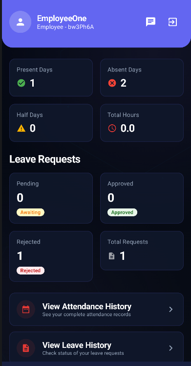
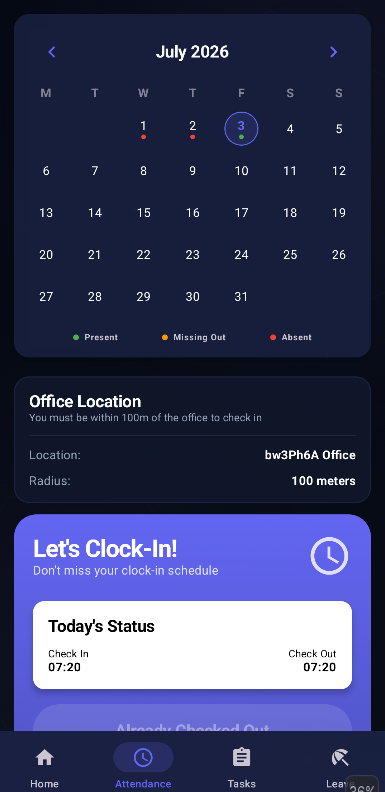
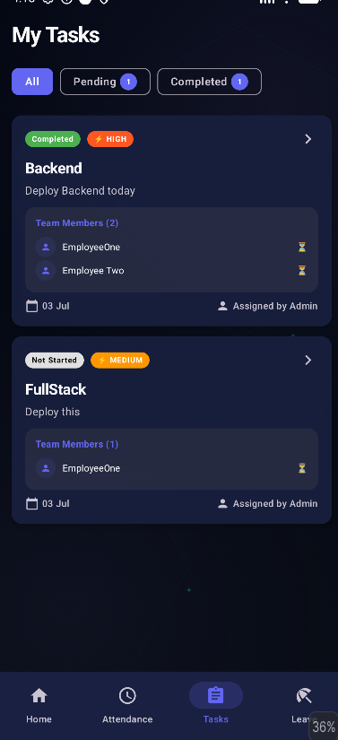
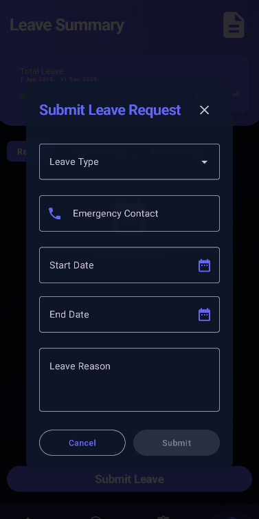
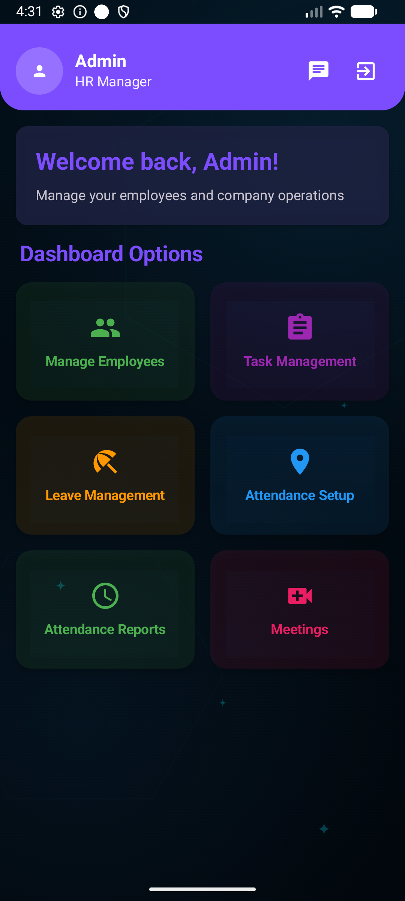
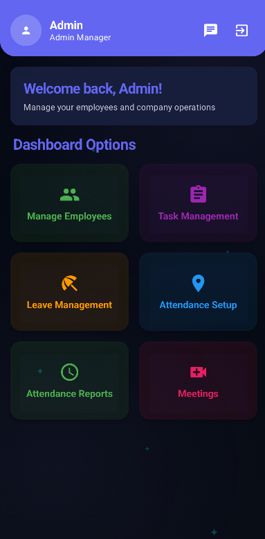
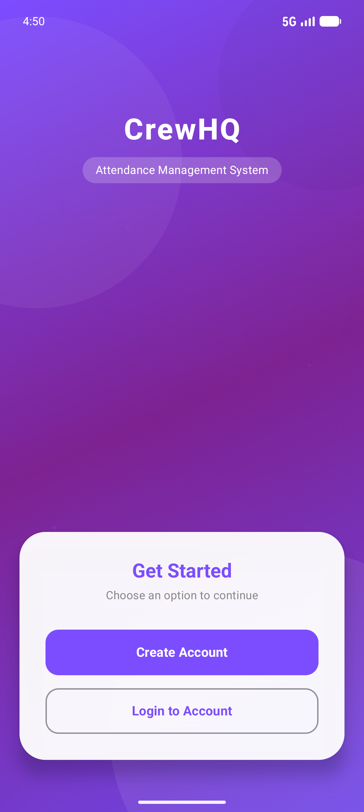

# CrewHQ App

A comprehensive Crew & Operations Management System built with modern Android development practices using Jetpack Compose and Kotlin, powered by Spring Boot backend.

## 📱 Screenshots

### 👤 Employee Features

  
  
  
  

### 👑 Admin Features

  
  
  

### 🌐 General

  

## 🚀 Features

### 🔐 Authentication & Authorization
- **Custom Authentication**: Email/password sign up and sign in
- **Google OAuth**: One-click Google sign up/sign in integration
- **JWT Token Management**: Secure token-based authentication
- **Role-based Access Control**: Separate interfaces for Admin and Employees

### 👤 Profile Management
- **Profile Creation & Editing**: Complete profile setup with image upload
- **Image Storage**: Profile pictures stored securely using Supabase
- **Real-time Updates**: Instant profile updates across the app

### 🏢 Company Management
- **Company Creation**: Admin can create and manage companies
- **Employee Onboarding**: Employees can join companies using company codes
- **Employee Approval System**: Admin can approve/reject employee join requests
- **Employee Management**: Admin can remove employees from the company
- **Company Updates**: Employees can switch between companies

### 📋 Task Management
- **Task Creation**: Admin can create detailed tasks with priorities
- **Task Assignment**: Assign tasks to multiple employees
- **Status Tracking**: Real-time task status updates (Not Started, In Progress, Finished)
- **Individual Progress**: Track each employee's progress on tasks
- **Auto-completion**: Tasks automatically marked as finished when all employees complete
- **Comments System**: Discussion threads on tasks with Admin badges
- **Image Attachments**: Tasks can include reference images

### 📝 Leave Management
- **Leave Applications**: Employees can apply for leaves with details
- **Approval Workflow**: Admin can approve/reject leave requests
- **Leave History**: Complete history of all leave requests
- **Status Tracking**: Real-time leave status updates
- **Admin Dashboard**: Centralized leave management for Admin

### 📍 Attendance & Geofencing
- **Office Location Setup**: Admin can set office locations with geofencing
- **Geofenced Check-in/Check-out**: Location-based attendance marking
- **Real-time Tracking**: Live attendance monitoring
- **Daily Reports**: Admin can view all employee attendance for any day
- **Attendance History**: Employees can view their complete attendance history
- **Location Validation**: Automatic location verification for attendance

### 📅 Meeting Management
- **Meeting Scheduling**: Admin can schedule meetings with multiple employees
- **Meeting Invitations**: Automatic notifications to invited employees
- **RSVP System**: Employees can accept/decline meeting invitations
- **Meeting Updates**: Real-time meeting status updates
- **Meeting History**: Complete meeting management dashboard

### 💬 Communication
- **Task Comments**: Threaded discussions on tasks
- **Admin Identification**: Special Admin badges in comments
- **Real-time Updates**: Instant comment notifications

## 🛠 Technology Stack

### Frontend (Android)
- **Language**: Kotlin
- **UI Framework**: Jetpack Compose
- **Architecture**: MVVM with Repository Pattern
- **State Management**: StateFlow & Compose State
- **Navigation**: Jetpack Navigation Compose
- **Image Loading**: Coil
- **HTTP Client**: Retrofit + OkHttp
- **Dependency Injection**: Manual DI with ViewModelFactory
- **Local Storage**: DataStore (SharedPreferences replacement)
- **Geofencing**: Android Location Services

### Backend
- **Framework**: Spring Boot (Java)
- **Database**: MongoDB with MongoDB Compass
- **Authentication**: JWT + Google OAuth 2.0
- **File Storage**: Supabase (Profile images, task attachments)
- **API Documentation**: RESTful APIs
- **Security**: Spring Security with JWT

### Cloud & Storage
- **Image Storage**: Supabase Storage
- **Database**: MongoDB Atlas (Cloud)
- **File Management**: Multipart file upload support

### Development Tools
- **IDE**: Android Studio
- **Version Control**: Git
- **Database GUI**: MongoDB Compass
- **API Testing**: Postman
- **Image Storage**: Supabase Dashboard

## 📱 App Architecture

  

### 🤝 Contributing
-**Fork the repository**
-**Create your feature branch (git checkout -b feature/AmazingFeature)**
-Commit your changes (git commit -m 'Add some AmazingFeature')
-Push to the branch (git push origin feature/AmazingFeature)
-Open a Pull Request

Built with ❤️ using modern Android development practices
